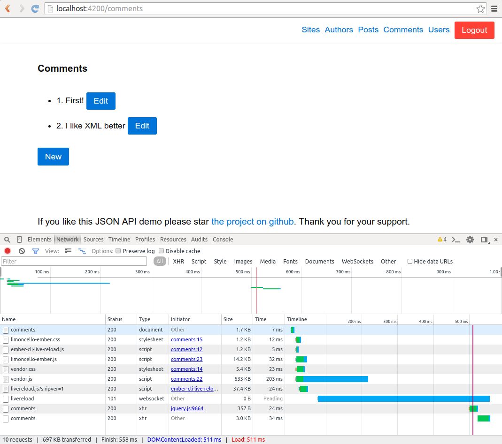

## Limoncello Ember

This is a client application for [JSON API](http://jsonapi.org/) quick start server applications [Limoncello Collins](https://github.com/neomerx/limoncello-collins) and [Limoncello Shot](https://github.com/neomerx/limoncello-shot).

It supports
- CRUD operations for Authors, Comments, Posts, Sites and Users.
- Cross-origin requests (CORS) to API server.
- Server login (Basic Auth) and API authentication (JWT Bearer).

### Prerequisites

You will need the following things properly installed on your computer.

* [Git](http://git-scm.com/)
* [Node.js](http://nodejs.org/) (with NPM)
* [Bower](http://bower.io/)
* [Ember CLI](http://www.ember-cli.com/)
* [PhantomJS](http://phantomjs.org/) (for tests only)

### Installation

* Install and run [Limoncello Collins](https://github.com/neomerx/limoncello-collins) or [Limoncello Shot](https://github.com/neomerx/limoncello-shot).
* `git clone <repository-url>` this repository
* change into the new directory
* `npm install`
* `bower install`

### Running / Development

* `ember s`
* Visit your app at [http://localhost:4200](http://localhost:4200).

#### Running Tests

* `ember test`
* `ember test --server`

#### Building

* `ember build` (development)
* `ember build --environment production` (production)

### Credits

I would like to especially thank [Christopher](https://github.com/lindyhopchris) for his invaluable help and advice.

### Licence

MIT
